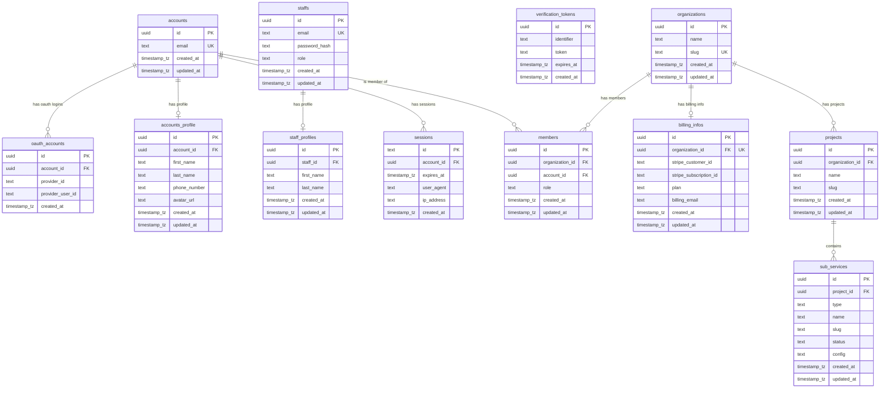

# `@workspace/database`

Package ini mengelola skema database, migrasi database, dan penyediaan Drizzle Client untuk aplikasi di dalam monorepo.

## Teknologi Utama
- **Drizzle ORM** sebagai TypeScript ORM yang ringan dan type-safe.
- **PostgreSQL** sebagai database relational utama.
- **Drizzle Kit** untuk manajemen migrasi database secara deklaratif.

---

## Struktur Direktori

```
packages/database/
├── drizzle/              # File migrasi SQL hasil generate
├── src/
│   ├── schema/           # Definisi tabel database (Drizzle Schema)
│   │   ├── auth.ts       # Akun, Profil, Sesi, OAuth, Staff
│   │   ├── organization.ts # Organisasi, Anggota, Billing
│   │   ├── project.ts    # Proyek per Organisasi
│   │   ├── service.ts    # Sub-layanan (database, cache, dll.)
│   │   └── index.ts      # Entrypoint ekspor skema
│   └── db.ts             # Inisialisasi Drizzle Client
├── drizzle.config.ts     # Konfigurasi Drizzle Kit
└── package.json
```

---

## Skrip yang Tersedia

Jalankan perintah ini menggunakan `pnpm` dari root workspace atau langsung di dalam folder package:

### 1. `pnpm db:generate`
Membuat file migrasi SQL baru berdasarkan perubahan skema di folder `src/schema/`.
```bash
pnpm --filter @workspace/database db:generate
```

### 2. `pnpm db:push`
Mendorong (*push*) perubahan skema secara langsung ke database tujuan tanpa membuat file migrasi (sangat cocok untuk tahap pengembangan/development lokal).
```bash
pnpm --filter @workspace/database db:push
```

### 3. `pnpm db:studio`
Membuka antarmuka Drizzle Studio di browser untuk melihat, mengedit, dan mengeksplorasi data tabel secara GUI.
```bash
pnpm --filter @workspace/database db:studio
```

---

## Penggunaan Drizzle Client

Untuk menggunakannya di package atau aplikasi lain dalam workspace:

```typescript
import { db } from "@workspace/database";
import { accounts, sessions } from "@workspace/database/schema";

// Contoh query: Mendapatkan sesi aktif beserta akunnya
const activeSessions = await db.query.sessions.findMany({
  with: {
    account: true,
  },
});
```

---

## Skema Relasi Database (ERD)

Berikut adalah diagram hubungan entitas (ERD) dari skema database saat ini (dapat langsung dirender di GitHub menggunakan format Mermaid):


